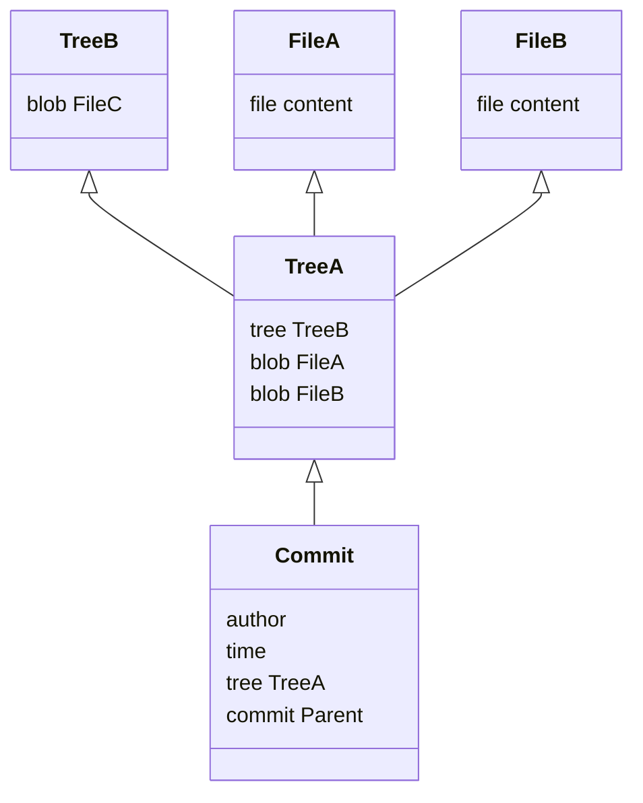

# 前言
   `Git`是一个版本控制系统，它在我们的工作中发挥着重要的作用。
       `git merge` 和 `git rebase` 两个指令是我们整合 `Git` 工作，合并不同分支内容的两大利器，但是它们两者的工作方式和对历史记录的影响却是截然不同的。
# Git 原理
在理解 `git merge` 和 `git rebase` 之前，我们先来简单的介绍下 `Git` 的内部原理，这将有助于对后续内容的理解。
## Git 的存储
`Git` 实际上是一个内容寻址文件系统，它的核心部分是一个简单的键值对数据库（key-value data store）。`Git` 在实现内容存储时，都会返回一个基于 `SHA-1` 算法计算出来的 `key`，我们可以通过这个 `key` 在任意时刻将内容读取出来。
> SHA-1 hash 是一个由十六进制字符（0-9和a – f）组成的40个字符字符串，如：b0850823c8e5797e01e071eb93b6194e4543a4b4

`Git` 将内容存储在 `Git` 对象中：
1. `blob` 对象：文件由 `blob` 对象存储，存储文件的全部内容（即文件快照）
2. `tree` 对象： 文件的目录结构由 `tree` 对象存储，对象中的每条记录含有一个指向 `blob` 对象或者子树对象的 SHA-1 指针，以及相应的模式、类型、文件名信息。
3. `commit` 对象：`Git` 的每一个提交由 `commit` 对象存储，对象中的内容包括提交者、提交的时间，以及指向顶层 `tree` 对象的指针（存储整个项目目录结构的 `tree` 对象，即项目快照），如果存在前一个 `commit`， 还会包含指向前一个 `commit` 的指针。

我们可以在项目中的 .git 文件夹中看到每一个由 `Git` 创建的 对象。

> .git 存储项目所有的 metadata 和 object database，执行 git clone 克隆一个项目时，其中最重要的就是将 .git 文件夹拷贝。

> Git 将每一个对象对应的 SHA-1 值的前两个字符作为目录名，余下的 38 个字符则用作文件名，所以每一个Git 对象对应的存储位置类似以下结构：.git/objects/4a/c34d0644fc69cab26a829f0da5497eda562940

## commit 与 branch 

每一个 `commit` 对象对应着我们在 `Git` 的每一次提交（即版本），每一个 `commit` 对象存储时返回的 `SHA-1` 值就是我们常说的 `commit id`。

每一个 `commit` 对象（除了第一个），都会包含一个指向上一个 `commit` 的指针，所以 `Git` 中的 `commit` 可以抽象成以下形式： 

**commit 实际上是一个对象，那么 branch 是什么呢？**

在 `Git` 中除了对象外，还有一种存储结构，称为引用（references），该引用类型的文件存储的是某一个`commit` 对象的 `SHA-1` 值，这样的文件通常有一些简单的名字，如 `master`，`dev` 等。

`Git` 的 `branch` 实际上，就是引用，是一个指向 `commit` 对象的可变指针。

一般 `Git` 项目中会有一个默认的分支 `master`，当我们从 `master` 切出一个名为 `dev` 的分支时，实际上就是对当前的 `commit` 对象创建了一个新的引用，并且它的内容会随着新的 `commit` 的创建而改变。

**那么 Git 在众多分支中，如何知道我们工作在哪个分支呢？**

这归功于一个名为 `HEAD` 的特殊的引用，这个引用特殊在它的内容不是指向 `commit` 对象的 `SHA-1` 值，而是其他引用文件。它当前的内容是哪个引用文件，便意味着 `Git` 当前工作在该引用文件所代表的 `branch` 上，并且它的内容会随着分支的切换而改变。

# merge

我们通常用 `git merge` 来合并两个不同 `branch` 的内容，通过前面的内容我们了解到 `branch` 实际上是指向 `commit` 的指针，合并不同的 `branch` 就是合并不同的 `commit`。

`merge` 可以分成两种情况：
- 快速合并
- 三方合并

满足快速合并的条件是其中一个 `commit` 是另一个 `commit` 的祖先。

当我们在 `dev` 上继续提交多个 `commit` 后，执行`git merge dev` 将 `master` 和 `dev` 分支合并。此时 `Git` 会寻找 `master` 和 `dev` 共同的祖先 `commit`，于是发现 `master` 指向的 `commit 62940` 就是 `commit 142e3` 的祖先，这时两者就能直接进行一个快速合并，并且不会存在任何冲突。

当 `merge` 完成后，`master` 指针会指向最新的 `commit 142e3`。

如果我们在 `dev` 分支提交 `commit` 的同时，也在 `master` 分支提交了 `commit`。当两者进行 `merge` 时，因为 `commit 33888` 和 `commit 142e3` 存在共同的祖先为 `commit 62940`，无法进行快速合并，此时便需要采用三方合并的方式进行处理。

三方合并是指将`commit 33888` 和 `commit 142e3` 以及它们的共同祖先 `commit 62940`，这三个 `commit` 的内容进行合并，同时会自动生成一个全新的 `commit` 对象记录合并之后的结果。

这个新的 `commit 6d5d1` 会同时存在两个父 `commit`。既包含了指向 `commit 33888` 的指针，又包含了指向 `commit 142e3` 的指针。 当 `merge` 完成后， `master` 指针会指向新的 `commit 6d5d1`。

**但是，三方合并并非总是一帆风顺的。**

三方合并需要将三个 `commit` 的内容合并，如果存在两个 `commit` 对同一文件同一部分做了不同的修改，此时合并就会出现冲突，因为`Git`不知道如何处理这种问题，所以需要我们手动的解决冲突。当出现冲突时，`Git` 会完成合并但是不会自动创建新的 `commit`，需要我们手动解决冲突后，自己通过 `git add` 和 `git commit` 创建新的 `commit`。

# rebase
`rebase` 在任何情况下，合并不同分支的 `commit` ，都是采用相同的处理方式。

下面以同时在 `master` 和 `dev` 创建 `commit` 为例，在 dev 分支上执行 `git rebase master` 合并`master` 分支的 `commit`。

首先 `Git` 会寻找到两个分支的共同祖先 `commit 62940` ，然后将 `dev` 分支基于该 `commit` 之后的每一次提交对应的修改都提取并保存为临时文件。之后就将 `dev` 的指针指向与 `master` 相同的 `commit 33888`。

然后再将临时文件的内容重新应用到该 `dev` 分支上，依次创建新的 `commit`，因为 `dev` 已经指向`commit 33888`，所以新的 `commit` 就依次创建在 `commit 33888` 之后。如果在这个过程中存在冲突，则 `rebase` 会中止，需要等待解决冲突后，让 `rebase` 继续进行。 

**注意：此时虽然重新应用到 dev 上的修改是一样的，但是因为依次重新创建了 commit，因此 commit 对应的 SHA-1 值是不同的，即 commit id 不同了。**

**因为 rebase 的过程存在重新应用修改，重新创建commit 的过程，因此使用rebase时可能会遇到需要不断地重新解决冲突的问题。**

# 总结

了解了这么多有关 `merge` 和 `rebase` 的内容，有些同学可能会想：在 `Git` 合并分支时，使用哪一种方式更好呢？其实这个问题没有标准答案，只能是在不同的情境下选择合适的方式。

我们不难发现，使用 `rebase` 的方式能够使我们保持整洁的 `commit` 记录，这是一种剔除枝叶维护主干的工作方式。而 `merge` 的方式，会留下支干，同时还会增加一些由 `merge` 创建的 `commit`，它并不整洁，却能够完整的记录下所有的工作痕迹。
